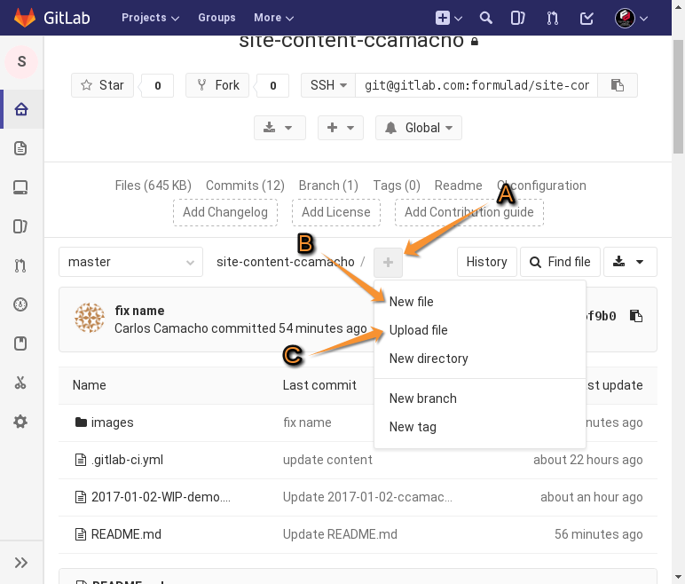
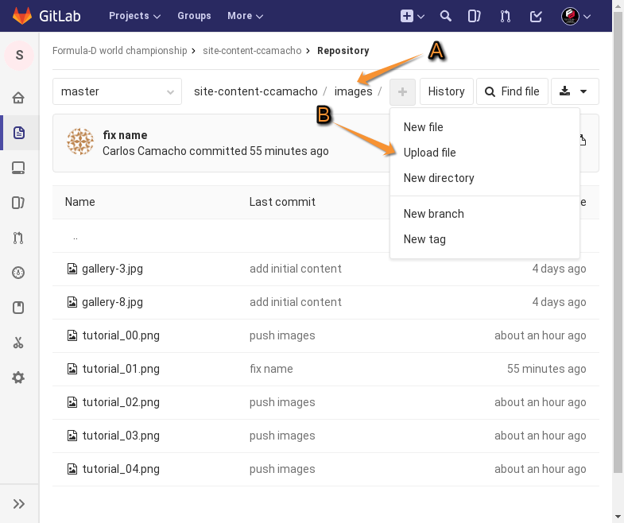
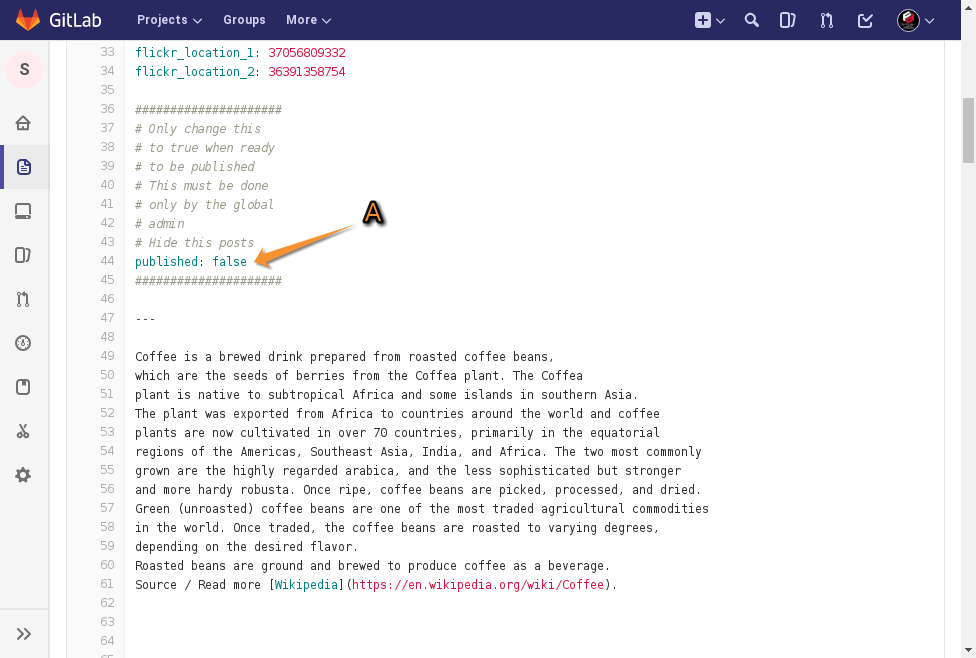
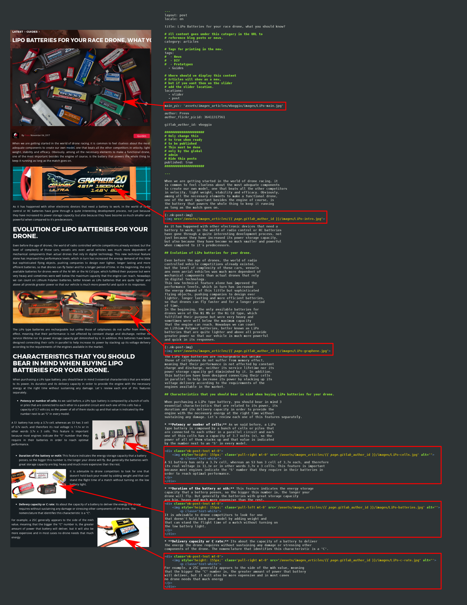

# How to publish new content in www.formulad.org

This tutorial will help you to go through the process of
creating a new post on the different categories for the
press team content.

## Create a user in gitlab.com

As all the site is text files based, we will
use GitLab for versioning and to control the
deployment pipelines when a press team
member publish new content to the site.

## Accessing the content repository

This is the first view that a writer should see when posting new
content.


* A: Content repository address. This is the current repository address usually `site-content-<username>`.
* B: Images folder. I this folder each writer can add their own pictures for their articles, there
must be uploaded only JPG, PNG and GIF images.
* C: Demo post with all markdown syntax. This is a demo post with all the information needed to create
new articles. Writers can copy/paste this file and update it according their needs. The naming convention
for this file is `YYYY-MM-DD-WIP-<slug>.md` where the `WIP` word must be removed once the writer finish the post, and
the slugh is usually the title in which each word is separated by a dash `-`. There MUST not be any space in the file names. 
* D: This README.md tutorial

## Demo post content and syntax

This section will describe how each article must be created in order to work with the
publishing workflows.


### General description


* A: The article demo file path, here you can see the file you are updating.
* B: The name to be updated.
* C: The article language, it can be `en` if it's English or `es` if it's an Spanish article.
* D: The article title.
* E: The article tags, depending on the type of the article is necessary to comment those categories not
related to the article, is only needed to add a `#` at the beginning of the line, for example:

```
tags:
  - News
#  - DIY
#  - Prototypes
#  - Guides
```

This will produce an article only published in the news section.


* A: The article location, by default they are in the home slider and published in the corresponding category.
* B: The main article picture, this will be the picture displayed in the website's main page,
also will be the main at the beginning of the article, the name must be
`assets/images_articles/<username>/images/<image>`. The only that needs to be changes is the
file name, as the example already have the correct path.
* C: The author name
* D: The author flickr picture id, this value will be provided in the example, so it shouldn't be
needed to update it.
* E: The writer gitlab user id, this valued is correctly provided in the example so it shouldn't be
needed to update it.
* F: This value `published` is configured to false by default, once the article is revised and
ready to be published an user with higher privileges will change it, it shouldn't be updated
by writers.


* A: The article body, the syntax used for all articles in Markdown, so by default we provide a
full example with all components that will be needed. Writers can update this as needed and all
the parts not needed can be removed until the end of the file.


* A: This is an example about the code required to add an image aligned to the left of the article.

### How to upload a new post

The first step is to download, rename the demo file and upload the new one.



* A: The user needs to click the `+` button.
* B: The user needs to click the `New file` button if they want to create a new file.
* C: The user needs to click the `Upload file` button if they want to upload an existing file.

### How to upload a new image



If the user needs to upload an image, the process is the same, in this case it must click first in the `images`
folder and execute the following steps:
* A: Verify that it will upload the image in the `images` folder.
* B: Click in the `Upload file` option.

## How to verify the recently posted article

There are several URL's to verify the articles in the mean time they are written, revised or published.

* When a writer is finishing a new article it can be verified in the URL `http://draft.frmld.org` there depending 
on the language (selected on the upper right corner) the writer can check the posts in their according section.
The content sections are:

* English news `http://draft.frmld.org/en/latest/news/`
* English diy `http://draft.frmld.org/en/latest/diy/`
* English guides `http://draft.frmld.org/en/latest/guides/`
* English prototypes `http://draft.frmld.org/en/latest/prototypes/`

* Spanish news `http://draft.frmld.org/es/latest/news/`
* Spanish diy `http://draft.frmld.org/es/latest/diy/`
* Spanish guides `http://draft.frmld.org/es/latest/guides/`
* Spanish prototypes `http://draft.frmld.org/es/latest/prototypes/`

## Finishing the process

Once the process is finished a person with enough rights will change the published status to `true` (A).



# Markdown equivalence between the preview and the article .md source file

In the following picture you will be able to see the equivalence between the published Markdown file and
the article preview available in http://draft.frmld.org/<your article identifier>.

