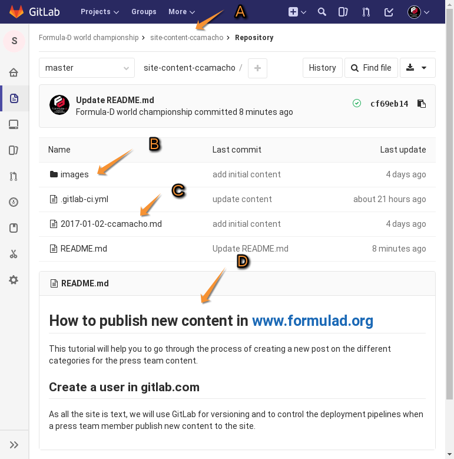
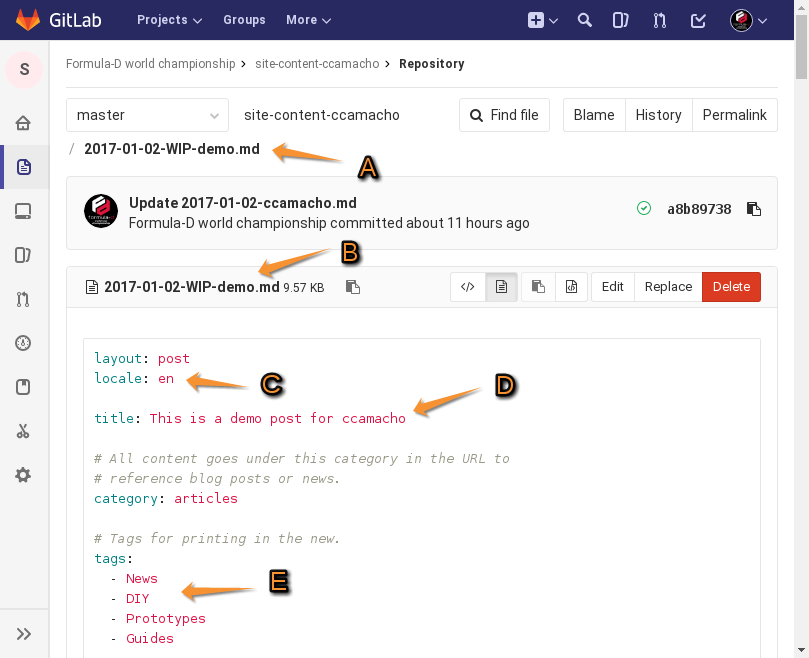
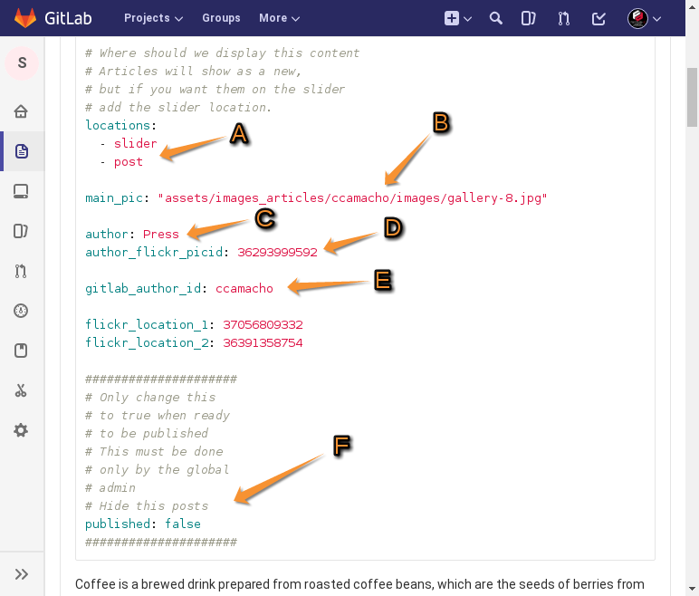

# How to publish new content in www.formulad.org

This tutorial will help you to go through the process of
creating a new post on the different categories for the
press team content.

## Create a user in gitlab.com

As all the site is text files based, we will
use GitLab for versioning and to control the
deployment pipelines when a press team
member publish new content to the site.

## Accesing the content repository

This is the first view that a writher should see when posting new
content.

* A: Content repo address
* B: Images folder
* C: Demo post with all markdown syntax
* D: This README.md tutorial

## Demo post content and syntax

### General description

### How to upload a new post

## Images folder

### How to upload a new image

## How to verify the recently posted article

## Finishing the process

